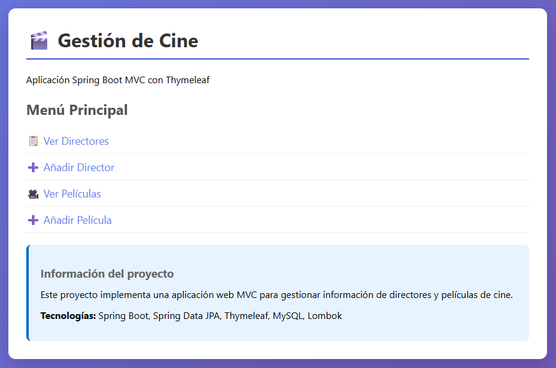
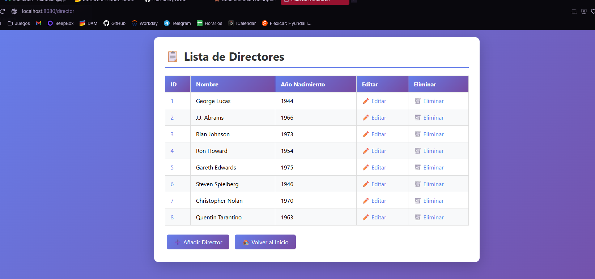
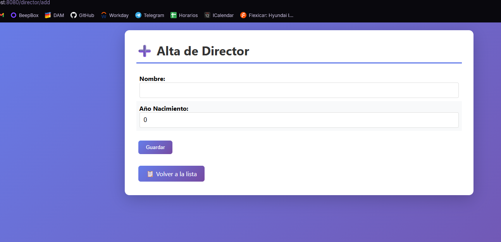
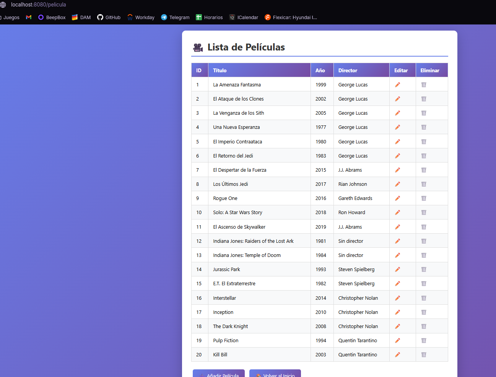
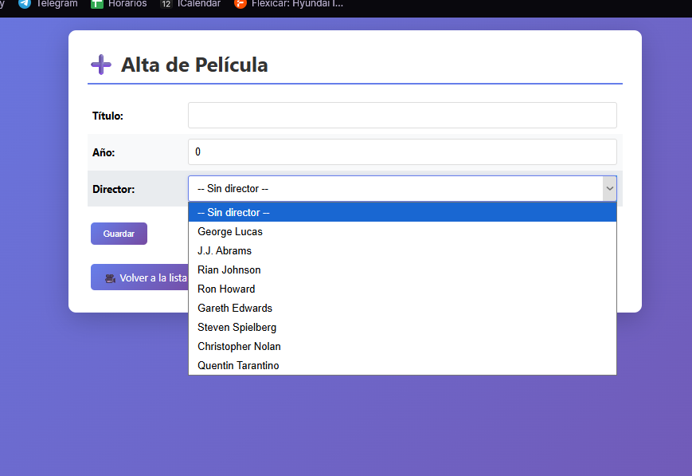
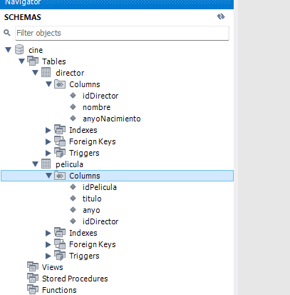

# Memoria del Proyecto AD06

## Aplicación Web MVC con Spring Boot y Thymeleaf 

**Repositorio:** [github.com/little-shiny/AD06](https://github.com/little-shiny/AD06)
**Módulo:** UD06 — Tarea Obligatoria RA5
**Tecnologías:** Spring Boot · Spring Data JPA · Thymeleaf · MySQL · Maven

---

## 1. Introducción

Este proyecto implementa una aplicación web que permite gestionar una base de datos de un cine, concretamente sus **directores** y sus **películas**. La aplicación sigue el patrón arquitectónico **MVC** (Modelo-Vista-Controlador) y utiliza una estructura por capas típica de Spring Boot, en la que cada capa tiene una responsabilidad bien definida.

El modelo de datos se compone de dos entidades relacionadas:

- **Director** (`idDirector`, `nombre`, `anyoNacimiento`)
- **Pelicula** (`idPelicula`, `titulo`, `anyo`, `director`)

La relación entre ambas es de **uno a muchos** (1:N): un director puede haber dirigido muchas películas, pero cada película tiene un único director asociado mediante una clave foránea.

---

## 2. Estructura del proyecto y carpetas principales

El proyecto sigue la estructura estándar de un proyecto Maven con Spring Boot. A continuación se muestra el árbol de carpetas y archivos más relevantes:

```
AD06/
├── pom.xml                          ← Configuración de Maven y dependencias
├── README.md                        ← Documentación del proyecto
├── guia_ejercicio.html              ← Guía de los TODOs a completar
├── .gitignore
│
├── mysql/
│   └── Cine.sql                     ← Script de creación de la BD
│
└── src/main/
    ├── java/com/joange/
    │   ├── CineApplication.java     ← Clase principal (punto de entrada)
    │   │
    │   ├── model/                   ← CAPA MODELO (Entidades JPA)
    │   │   ├── Director.java
    │   │   └── Pelicula.java
    │   │
    │   ├── repository/              ← CAPA REPOSITORIO (Acceso a datos)
    │   │   ├── DirectorRepo.java
    │   │   └── PeliculaRepo.java
    │   │
    │   ├── service/                 ← CAPA SERVICIO (Interfaces)
    │   │   ├── DirectorService.java
    │   │   └── PeliculaService.java
    │   │
    │   ├── serviceImpl/             ← CAPA SERVICIO (Implementación)
    │   │   ├── DirectorServiceImpl.java
    │   │   └── PeliculaServiceImpl.java
    │   │
    │   └── controller/              ← CAPA CONTROLADOR (Endpoints HTTP)
    │       ├── AppController.java
    │       ├── DirectorController.java
    │       └── PeliculaController.java
    │
    └── resources/
        ├── application.properties   ← Configuración de la conexión a MySQL
        ├── static/css/
        │   └── estilos.css          ← Estilos CSS de la aplicación
        └── templates/               ← Plantillas Thymeleaf (vistas HTML)
            ├── directores.html
            ├── directorForm.html
            ├── peliculas.html
            └── peliculaForm.html
```

### Descripción de las carpetas principales

| Carpeta | Propósito |
|---------|-----------|
| `pom.xml` | Define el proyecto Maven, sus dependencias (Spring Boot Starter Web, Data JPA, Thymeleaf, MySQL Connector, etc.) y la versión de Java. |
| `mysql/` | Contiene el script SQL para crear la base de datos `Cine` y sus tablas. |
| `src/main/java/com/joange/` | Código fuente Java organizado por capas (paquetes). |
| `src/main/resources/` | Recursos de la aplicación: configuración, archivos estáticos (CSS) y plantillas HTML. |
| `resources/templates/` | Vistas HTML renderizadas por Thymeleaf. Spring Boot las localiza automáticamente aquí. |
| `resources/static/` | Archivos servidos tal cual al navegador (CSS, JS, imágenes). |

---

## 3. Función de cada capa

La arquitectura del proyecto sigue el patrón clásico de **capas separadas por responsabilidad**, donde los datos fluyen desde el navegador hasta la base de datos atravesando cada capa:

```
Navegador ↔ Controller ↔ Service ↔ Repository ↔ Base de datos MySQL
               ↕
           Vistas (Thymeleaf)
```

Esta separación facilita el mantenimiento, las pruebas y permite que cada capa pueda evolucionar de forma independiente.

### 3.1. Capa Modelo (`model/`)

La capa Modelo representa los **datos del dominio** de la aplicación. Cada clase de este paquete se corresponde con una tabla de la base de datos gracias a las anotaciones de **JPA** (Jakarta Persistence API).

**Clases del proyecto:**

- **`Director.java`** — Representa un director de cine. Está anotada con `@Entity` para indicar que es una entidad persistente. Su campo `idDirector` lleva `@Id` y `@GeneratedValue` para indicar que es la clave primaria autogenerada. Incluye atributos básicos como `nombre` y `anyoNacimiento`.

- **`Pelicula.java`** — Representa una película. Además de sus atributos propios (`titulo`, `anyo`), contiene una relación `@ManyToOne` hacia `Director`, que JPA traduce a una clave foránea en la tabla `Pelicula`. El atributo `@JoinColumn` indica el nombre de la columna FK en la base de datos.

**Responsabilidades:**

- Definir la estructura de los datos mediante atributos.
- Declarar la correspondencia entre clases Java y tablas SQL (mapeo ORM).
- Establecer las relaciones entre entidades (`@OneToMany`, `@ManyToOne`).
- Proporcionar getters, setters y constructores para acceder a los datos.

> En esta capa **no hay lógica**: solo estructura y metadatos de persistencia.

### 3.2. Capa Repositorio (`repository/`)

La capa Repositorio es la encargada del **acceso a la base de datos**. Spring Data JPA permite hacerlo con muy poco código: basta con declarar una interfaz que extienda de `JpaRepository` y automáticamente se dispone de los métodos CRUD más habituales (`save`, `findById`, `findAll`, `deleteById`, etc.).

**Interfaces del proyecto:**

- **`DirectorRepo.java`** — Extiende `JpaRepository<Director, Integer>`. Además de los métodos heredados, incluye la consulta personalizada `findDirectorByYear` definida con `@Query` en JPQL, que devuelve los directores nacidos en un año concreto.

- **`PeliculaRepo.java`** — Extiende `JpaRepository<Pelicula, Integer>` y añade consultas JPQL personalizadas para filtrar películas por año o por director.

**Responsabilidades:**

- Realizar operaciones CRUD sobre las entidades.
- Ejecutar consultas personalizadas mediante JPQL o métodos derivados del nombre.
- Aislar a las capas superiores de los detalles de JDBC y SQL.

> El repositorio **solo habla con la base de datos**: no contiene reglas de negocio ni lógica de presentación.

### 3.3. Capa Servicio (`service/` y `serviceImpl/`)

La capa Servicio contiene la **lógica de negocio** de la aplicación. Actúa como intermediario entre el controlador y el repositorio, orquestando las operaciones que requieren más de una llamada al repositorio o reglas adicionales.

El proyecto sigue el patrón **interfaz + implementación**, separando la definición del contrato del código que lo implementa:

- **Interfaces** (`service/`): `DirectorService.java` y `PeliculaService.java`. Declaran las firmas de los métodos que ofrecerá la lógica de negocio (por ejemplo, `listarTodas()`, `buscarPorId()`, `guardar()`, `eliminar()`).

- **Implementaciones** (`serviceImpl/`): `DirectorServiceImpl.java` y `PeliculaServiceImpl.java`. Son las clases anotadas con `@Service` que Spring inyecta en los controladores. Usan `@Autowired` para recibir el repositorio correspondiente y delegar en él las operaciones de persistencia.

**Responsabilidades:**

- Implementar las reglas de negocio de la aplicación.
- Coordinar llamadas a uno o varios repositorios.
- Gestionar transacciones cuando sea necesario (`@Transactional`).
- Ofrecer una API limpia a los controladores sin exponer detalles del acceso a datos.

> Separar la interfaz de la implementación favorece el **desacoplamiento** y facilita sustituir la implementación (por ejemplo, para hacer tests) sin cambiar el código del controlador.

### 3.4. Capa Controlador (`controller/`)

La capa Controlador es la **puerta de entrada** a la aplicación desde el navegador. Recibe las peticiones HTTP, invoca la lógica de negocio apropiada en la capa servicio y decide qué vista renderizar (o qué datos devolver).

**Clases del proyecto:**

- **`AppController.java`** — Gestiona las rutas generales de la aplicación (por ejemplo, la página de inicio `/`).

- **`DirectorController.java`** — Anotada con `@Controller` y mapeada a `/directores`. Gestiona el listado, la adición, la edición y la eliminación de directores. Cada método está asociado a una URL y a un verbo HTTP mediante `@GetMapping` o `@PostMapping`.

- **`PeliculaController.java`** — Análogo al anterior pero para películas, mapeado a `/peliculas`. Gestiona el CRUD completo y, al mostrar el formulario, carga también la lista de directores disponibles para el selector.

**Responsabilidades:**

- Atender las peticiones HTTP y extraer los parámetros (`@PathVariable`, `@RequestParam`, `@ModelAttribute`).
- Llamar a los métodos de la capa servicio.
- Rellenar el `Model` con los datos que la vista necesita mostrar.
- Devolver el nombre de la plantilla Thymeleaf que Spring debe renderizar.
- Redirigir al usuario tras una operación de modificación (`redirect:`).

> El controlador **no debería contener lógica de negocio**: su papel es coordinar petición → servicio → vista.

### 3.5. Las Vistas (Thymeleaf)

Aunque técnicamente no son una capa Java, las vistas forman la **V** del patrón MVC. Son plantillas HTML con atributos especiales de Thymeleaf (`th:each`, `th:text`, `th:action`, `th:field`, `th:href`) que se procesan en el servidor para generar el HTML final que llega al navegador.

Las plantillas del proyecto son:

- `directores.html` — Listado de directores con botones de editar y eliminar.
- `directorForm.html` — Formulario para crear o editar un director.
- `peliculas.html` — Listado de películas con el nombre de su director.
- `peliculaForm.html` — Formulario para crear o editar una película, con un `<select>` que muestra todos los directores disponibles.

---

## 4. Flujo de una petición completa

Para entender cómo cooperan las capas, veamos qué ocurre cuando el usuario pulsa en “Ver películas”:

1. El navegador envía una petición `GET /peliculas` al servidor.
2. Spring dirige la petición al método correspondiente de `PeliculaController`.
3. El controlador llama a `peliculaService.listarTodas()`.
4. `PeliculaServiceImpl` delega en `peliculaRepo.findAll()`.
5. `PeliculaRepo`, gestionado por Spring Data JPA, ejecuta un `SELECT` en MySQL y devuelve una lista de objetos `Pelicula`.
6. La lista vuelve por las capas hasta el controlador, que la añade al `Model` y devuelve `"peliculas"`.
7. Thymeleaf procesa `peliculas.html` sustituyendo los atributos por los datos reales.
8. El HTML renderizado llega al navegador del usuario.

---

## 5. Capturas de pantalla de la aplicación funcionando

### 5.1. Página de inicio




Página principal con enlaces a las secciones de directores y películas.

### 5.2. Listado de directores




Tabla con todos los directores almacenados, mostrando nombre y año de nacimiento, junto con las acciones de editar y eliminar.

### 5.3. Formulario de director (alta / edición)




Formulario con los campos del director. Se usa tanto para crear un nuevo registro como para modificar uno existente.

### 5.4. Listado de películas




Tabla con todas las películas, incluyendo título, año y el nombre del director relacionado.

### 5.5. Formulario de película (alta / edición)




Formulario con los campos de la película y un desplegable para seleccionar el director.

### 5.6. Base de datos MySQL




Captura de las tablas `Director` y `Pelicula` en MySQL Workbench o phpMyAdmin, mostrando los registros insertados desde la aplicación.

---

## 6. Conclusión

El proyecto AD06 es un ejemplo claro de aplicación **Spring Boot MVC** estructurada por capas. Cada capa tiene una responsabilidad bien definida:

- **Model** — modela los datos y su mapeo con la base de datos.
- **Repository** — encapsula el acceso a la base de datos.
- **Service** — concentra la lógica de negocio.
- **Controller** — gestiona las peticiones HTTP y coordina todo.
- **Vistas Thymeleaf** — presentan la información al usuario.

Esta separación de responsabilidades hace que el código sea más **mantenible, testeable y escalable**, y constituye una base sólida para entender cómo se construyen aplicaciones web profesionales con el ecosistema de Spring.